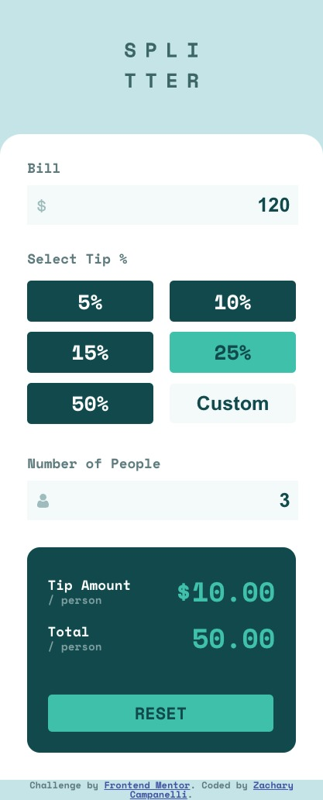
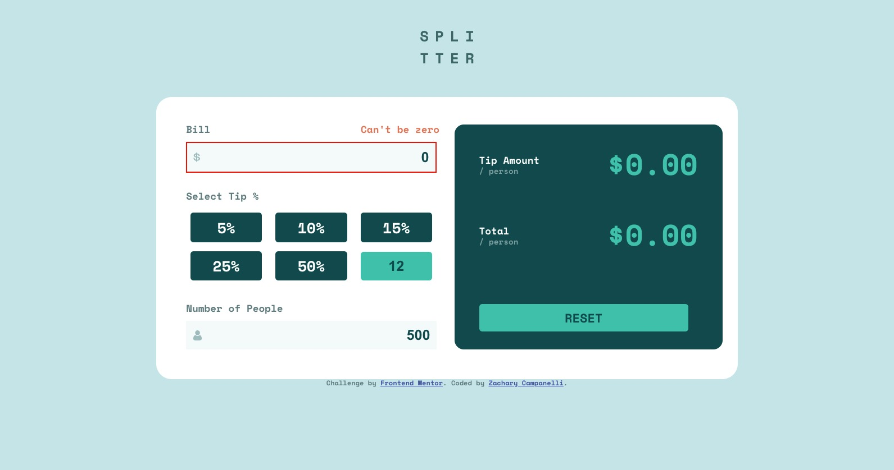

# Frontend Mentor - Tip calculator app solution

This is a solution to the [Tip calculator app challenge on Frontend Mentor](https://www.frontendmentor.io/challenges/tip-calculator-app-ugJNGbJUX). Frontend Mentor challenges help you improve your coding skills by building realistic projects.

## Table of contents

- [Overview](#overview)
  - [The challenge](#the-challenge)
  - [Screenshot](#screenshot)
  - [Links](#links)
- [My process](#my-process)
  - [Built with](#built-with)
- [Author](#author)
- [Acknowledgments](#acknowledgments)

## Overview

### The challenge

Users should be able to:

- View the optimal layout for the app depending on their device's screen size
- See hover states for all interactive elements on the page
- Calculate the correct tip and total cost of the bill per person

### Screenshot

 
  

### Links

- Solution URL: [github.com/Zacharycampanelli/Tip-Calculator](https://github.com/Zacharycampanelli/Tip-Calculator)

- Live Site URL: [zacharycampanelli.github.io/Tip-Calculator](https://zacharycampanelli.github.io/Tip-Calculator)

## My process

### Built with

- Semantic HTML5 markup
- CSS custom properties
- Flexbox
- Sass
- Mobile-first workflow
- JavaScript

## Author

- GitHub: [Zacharycampanelli](https://github.com/Zacharycampanelli)  
- Frontend Mentor - [@Zacharycampanelli](https://www.frontendmentor.io/profile/Zacharycampanelli)
- Email: [zaccamp@optonline.net](mailto:zaccamp@optonline.net)

## Acknowledgments

- [Frontend Mentor](https://www.frontendmentor.io)

